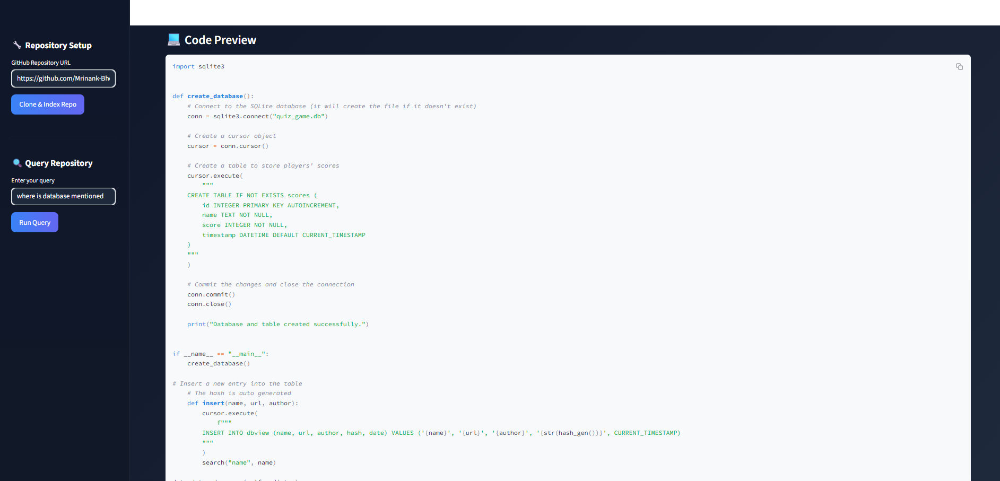
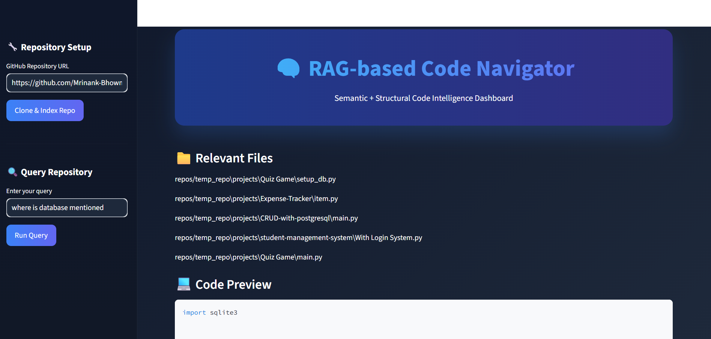

# 🧠 RAG Code Navigator

RAG Code Navigator is a Streamlit-based Retrieval-Augmented Generation (RAG) system that enables developers to analyze and query GitHub repositories using natural language.

It combines semantic search, structural code analysis, and vector embeddings to help users understand large Python codebases efficiently.

---

## 🎯 Project Objective

Understanding large repositories is time-consuming.  
This project simplifies code exploration by:

- Cloning a GitHub repository
- Extracting Python source files
- Generating vector embeddings
- Performing semantic search over the code
- Providing structural insights about the repository

---

## 🚀 Key Features

### 🔎 1. Repository Analysis
- Clone any public GitHub repository
- Extract all Python files
- Detect:
  - Total Python files
  - Total functions
  - Total classes
  - Entry points (`if __name__ == "__main__"`)

### 🧠 2. Semantic Code Search (RAG)
- Chunk source code using LangChain
- Generate embeddings using Sentence Transformers
- Store vectors using FAISS
- Retrieve relevant code using similarity search
- Answer natural language queries about the repository

### 📊 3. Structural Statistics Panel
- Repository summary
- Codebase metrics
- Function & class count
- File-level insights

---

## 🏗️ System Architecture

1. Streamlit UI (app.py)
2. GitHub Repository Cloner
3. Code Parser & Analyzer
4. LangChain Text Splitter
5. Sentence Transformer Embedding Model
6. FAISS Vector Store
7. Query Engine

---

## 🛠️ Tech Stack

- Python
- Streamlit
- LangChain
- FAISS (Vector Database)
- Sentence Transformers
- Git
- GitHub

---

## 📂 Project Structure
rag-code-navigator/
│
├── app.py
├── requirements.txt
├── README.md
├── .gitignore
├── screenshots/
│ ├── dashboard.png
│ ├── analyze.png
│ ├── query.png
│
├── docs/
│ └── documentation.md


---

## 📦 Installation

### 1️⃣ Clone Repository

```bash
git clone https://github.com/YOUR_USERNAME/rag-code-navigator.git
cd rag-code-navigator

2️⃣ Create Virtual Environment
python -m venv .venv
.venv\Scripts\activate

3️⃣ Install Dependencies
pip install -r requirements.txt

4️⃣ Run Application
streamlit run app.py

📸 Screenshots
[DASHBORAD] screenshots/dashboard.png

### Repository Analysis


### Query Result

